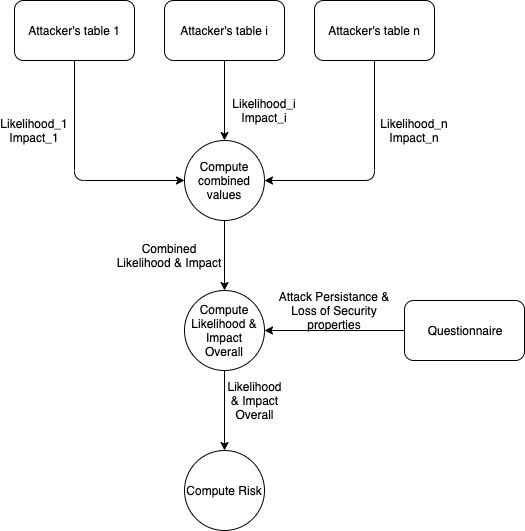

## Da implementare
* Salvare tutti i valori per ogni attaccante. *[1]*;
* Inserire nel questionario domanda del tipo 'che tipo di dati sono trattati?'. Tale domanda serve per fornire il valore del Loss of Security Properties. *[2]*;
* Definire una logica che in base al protocollo e agli attaccanti fornisca il valore dell'Attack Persistance;
* Definire una logica che combini Likelihood e Impact delle combinazioni di attaccanti;
* Definire una logica che calcoli la Overall Likelihood e Overall Impact;
* Definire una logica che calcoli il Risk.

## Risk Analysis process flow

<!--stackedit_data:
eyJoaXN0b3J5IjpbLTk2ODA0Mjc4LC00MDQ2Mjg0NDRdfQ==
-->